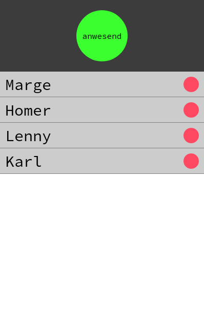
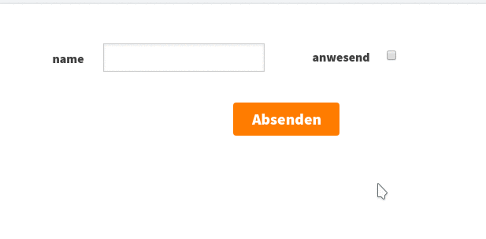

LivingApps Loves Node.js
========================

Mit LivingApps erschafft LivingLogic eine Lösung, die es den Nutzern
erlaubt mit keinem oder kaum Programmieraufwand einfache bis komplexe
IT-Projekte selbst umzusetzen. Für mehr Informationen zu Livingapps
besuchen Sie bitte die `Webseite  von LivingApps`__.

__ https://www.living-apps.de/

LivingApps für IoT, Alexa und Co.
---------------------------------

Mithilfe der LivingAPI
(`Python <https://github.com/LivingLogic/LivingApps.Python.LivingAPI>`__/`Javascript <https://github.com/LivingLogic/LivingApps.Javascript.LivingAPI>`__)
sollen nun IoT Projekte, Alexa Skills und vieles anderes erstellbar
sein. In diesem Post soll an einem Anwendungsbeispiel vorgestellt
werden, wie Sie mit dem Javascript SDK ein Projekt umsetzen können.

Vorrausetzungen
---------------

Zu Beginn wird mit einer Idee von LivingApps gebrochen. Und zwar
benötigen Sie Kenntnisse in Javascript und Node.js. Denn LivingApps wird
lediglich als Backend verwendet und der Rest muss von Ihnen programmiert
werden. Natürlich benötigen Sie neben den Programmierkenntnissen auch
einen LivingApps Zugang und bereits ein paar Basiskenntnisse, wie z.B.
wie erstelle ich eine App, wie gebe ich Daten ein unsw.

Demo-App: Anwesenheit
---------------------

In diesem Post werden wir eine Anwendung erstellen, in der die
Mitarbeiter einer fiktiven Firma angeben können, ob Sie am Platz sind
oder nicht. Die Kollegen sollen dann in einer Liste, die in Echtzeit
aktualsiert wird, den Überblick haben, wer ist an seinem Platz und wer
nicht. Zusätzlich soll man Alexa fragen können, ob Mitarbeiter xy an
seinem Platz sitzt und über einen physikalischen Knopf soll der
Mitarbeiter xy der App mitteilen, dass er am Arbeitsplatz sitzt.

Webapp kommuniziert über Sockets
--------------------------------

Eine Webapp wie ein Chat oder eben die Oben genannte Anweseheitsapp soll
immer dann den Datensatz laden, wenn ein neuer erstellt wurde oder sich
ein existierender geändert hat. Ein Variante wäre es z.B. jede Sekunde
von der Webapp eine Anfrage an den Server zu schicken und die Antwort
jedes mal neu zu Rendern. Wäre es nicht eleganter, wenn nur neu geladen
wird, wenn ein Datensatz sich verändert?

Anwesenheit Server
------------------

Um das Laden der Daten nur bei Veränderung eines Datensatzes zu
ermöglichen benötigen wir einen Server, der über einen Websocket mit der
Webapp kommuniziert und bei Bedarf vom LivingApps Server herunterlädt
und an alle Clients die neuen Datensätze verschickt. Für die Websockets
wird in diesem Beispiel das Package `socket.io <https://socket.io/>`__
verwendet.

Projekt anlegen
---------------

Zuallererst müssen Sie das Projekt anlegen. Gehen Sie dafür in ihren
Arbeitsordner und führen folgende Befehle im Terminal aus.

.. sourcecode:: bash

   mkdir Anwesenheit
   cd Anwesenheit
   mkdir Server
   cd Server
   npm init

Um jetzt Loslegen zu können, müssen noch Pakete und die LivingAPI
installiert werden. Führen Sie dafür folgende Befehle aus.

.. sourcecode:: bash

   npm install --save express blueimp-md5 request socket.io

   git clone https://github.com/LivingLogic/LivingApps.Javascript.LivingAPI.git

   cp -R LivingApps.Javascript.LivingAPI/src scripts

   rm -R LivingApps.Javascript.LivingAPI

   touch index.js

Nun haben wir den Projektordner aufgesetzt für den Server. Bevor Sie
aber Coden dürfen, müssen Sie eine App folgendermaßen bei LivingApps
erstellen. |cannot load image|

1. Gehen Sie auf die LivingApps `Login Seite <https://my.living-apps.de/login.htm>`__.

2. Melden Sie sich dort mit ihrem Nutzernamen und Passwort an.

3. Klicken Sie auf den Button mit der Beschriftung "Neue App erstellen"

4. In der App erstellen Sie ein Eingabefeld und benennen es mit "name".

5. Erstellen Sie ein Häkchen und benennen es "anwesend". Merken Sie sich beim
   Benennen den Inhalt des Kästchens "Beschriftung Datenmanagement". Falls
   dieser nun von "name" oder "abwesend" abweicht funktioniert das Skript nicht
   und Sie müssten im Tutorial andere Namen verwenden.

6. Erstellen Sie einen Absenden Button.

7. Speichern Sie die App und benennen Sie die App.

8. Gehen Sie über das Menü Konfigurationen in das "Erweitert" Fenster.

9. Im "Erweitert" Fenster sehen Sie im Seitenmenü den Punkt "Anzeige-Templates".
   Falls dies nicht so ist, ist Ihr Account noch nicht als Expertenaccount
   freigeschaltet. Um das zu ändern wenden Sie sich an LivingLogic

10. Klicken Sie auf den Menüpunkt "Anzeige-Templates" und auf der sich
    öffnenden Seite "Hinzufügen".

11. Benennen Sie ihr Template jetzt im Feld "Identifizierer".

12. Scrollen Sie herunter und setzen Sie bei Standard? ein Häkchen.

13. Scrollen Sie bis zum Ende und klicken auf "Speichern"

14. Jetzt sollten Sie die Möglichkeit haben die Datenquellen zu bearbeiten.
    Klicken Sie oben im Menü auf Datenquellen und fügen in der sich öffnenden
    Seite eine Datenquelle hinzu, indem Sie auf "Hinzufügen" klicken.

15. Hier wählen Sie jetzt bei dem Punkt App Ihre Anwesenheitsapp aus und fügen
    bei Identifizierer einen Namen hinzu. Im Beispiel ist der Identifizierer
    "basic".

16. Klicken Sie erneut auf Speichern.

17. Legen Sie ein paar Datensätze an.

Jetzt haben Sie eine LivingApp erstellt, die später über den Server
angesteuert werden kann.

Server Script
-------------

Jetzt können Sie mit dem eigentlichen Server anfangen. Öffnen Sie dafür
den Projektordner, den Sie vorhin angelegt habe in ihrem
Lieblingseditor. Im Beispiel wird VSCode verwendet.

.. sourcecode:: bash

   code .

Öffnen Sie das File "index.js" und fügen folgende Zeilen hinzu:

.. sourcecode:: javascript

   const livingSDK = require('./scripts/livingSDK');
   let express = require('express');
   let app = express();
   const http = require('http').Server(app);
   const io = require('socket.io')(http);
   const md5 = require('blueimp-md5');

In den oberen Zeilen werden die vorhin zum Projekt hinzugefügten Skripte
in index.js importiert.

Jetzt soll eine Verbindung zu LivingApps hergestellt werden. Erzeugen
Sie dazu das Objekt lsdk von der Klasse livingSDK.

.. sourcecode:: javascript

   let lsdk = new livingSDK('https://my.living-apps.de', 'you username', 'your password');

Nun kommt der Teil, wo mehr Wissen von Ihnen vonnöten ist. Alles in dem
Skript soll Promises verwenden. Erstellen wir eine Funktion die ein
Promise zurückgibt und in dem Promise werden von dem LivingApps Server
die Daten geholt.

.. sourcecode:: javascript

   function dataPromise () {
      return new Promise((resolve, reject) => {
         lsdk.get('your app id').then((res) => {
            let globals = res.globals;
            let datasources = res.datasources;
            let app = datasources.get('basic').app;
            let r = app.records.values();
            let k = [];
            let counter = 0;

            for (let d of r) {
               k[counter] = {};

               for (let ident of app.controls.keys()) {
                  k[counter][ident] = d.fields.get(ident).value;
               }
               counter++;
            }
            resolve(k);
         })
      });
   }

Mit lsdk.get() erhält die Funktion dataPromise Zugang zur LivingAPI. Von
dort aus können die Globals und die Datesources ausgelesen werden. Die
Funktion gibt am Ende ein Array aus, welches alle Datenbankeinträge, die
verlangt waren ab. Hier im Beispiel: [{name: ..., anwesend: false},
{name: ..., anwesend: true}]

Dem Nutzer soll das Array von dataPromise() gesendet werden, wenn der
User mit dem Server sich verbindet und wenn sich etwas ändert. Um die
Informationen beim verbinden zu schicken fügen Sie folgenden Code ein.

.. sourcecode:: javascript

   io.on('connection', (socket) => {
      console.log('user connected');
      dataPromise().then((res) => {
         socket.emit('data', res);
      });
   })

Sie erinnern sich, Sie haben in den ersten Zeilen socket.io eingebunden,
welches jetzt, wenn eine Socketverbindung aufgebaut wird das Event
"connection" auslöst und führt die dataPromise Funktion aus und schickt
deren Resultat zurück an den Client mit dem Event 'data'. Schon haben
Sie eine eigentlich funktionierende Version von dem Server, allerdings
schickt er nur die Daten, wenn ein User sich mit ihm verbindet, aber Sie
wollen doch einen Server für eine Webapp, die in Echtzeit alles anzeigt.
Also müssen Sie die Daten auch an den Client schicken, wenn sich eine
Änderung ergeben hat. Den untenstehenden Code müssen Sie in den io.on()
Block schreiben.

.. sourcecode:: javascript

   socket.on('update', (name, anwesenheit) => {
      lsdk.get('your app id').then((res) => {
         let globals = res.globals;
         let datasources = res.datasources;
         let app = datasources.get('basic').app;
         let r = app.records.values();
         let recordToUpdate;

         for (let d of r) {
            if (d.fields.get('name').value === name) {
               recordToUpdate = d;
            }
         }

         if (recordToUpdate === undefined) {
            return;
         } else {
            return recordToUpdate.update({anwesend: anwesenheit}).then ((res) => {
               if (res.Record) {
                  console.log('success');
               }
            })
         }
      })
      .then (() => {
         dataPromise().then((res) => {
            io.emit('data', res);
         });
      })
      .catch((err) => {
         console.error(err.message);
      })
   })

Im obenstehenden Code überprüft socket.io auf den bereits geöffneten
Socket ob das Event 'update', das zwei Parameter an die callback
Funktion übergibt, ausgelöst wird. In der Callback Funktion lädt das
Serverskript ähnlich wie bei dataPromise() die Daten vom LivingApps
Server. In der for-Schleife testet nun das Skript ob es einen Eintrag
bei LivingApps gibt, dessen Property 'name' den gleichen Wert hat wie
der Parameter 'name'. Wurde ein Eintrag gefunden, wir auf diesem die
Update Funktion ausgeührt. Danach wird wieder mit dataPromise() alle
Daten vom Server geladen und an alle Clients geschickt.

.. sourcecode:: javascript

   http.listen(3000, function () {
      console.log('listening on *:3000');
   });

Diesen Code fügen Sie am Ende des Skripts ein und so haben Sie nun einen
voll funktionstüchtigen Server der Sockets in Verbindung mit LivingApps
unterstützt. Der Server ist allerdings noch sehr nutzlos ohne ein
Frontend. Führen Sie folgende Befehle aus um das Frontend zu erhalten.
Starten Sie den Server indem Sie "node index.js" in ihrem Terminal
eingeben.

.. sourcecode:: bash

   cd ..
   git clone https://github.com/milleniumfrog/livingSDK-Demo-Website.git webseite
   cd webseite
   npm install

Öffnen Sie diesen Ordner mit ihrem Lieblingseditor und ändern Sie im
File 'List.vue', das im Ordner 'src/pages' liegt, Zeile 35 so ab, dass
ihre URL statt 'http://localhost:3000' dasteht, falls Sie den Server
nicht auf ihrem lokalen System installiert haben. Starten Sie den
Webserver indem Sie in den Ordner "webseite gehen und den Befehl "npm
run dev" ausführen.

   cannot load image

Am Ende sollte das Resultat des ersten Teils des Posts so aussehen wie
auf dem Bild.

Alexa frage Anwesenheit, ist Homer da
-------------------------------------

Ich: Alexa, wie erstelle ich einen Skill?

Alexa: Du kannst es
`hier <https://github.com/alexa/alexa-skills-kit-sdk-for-nodejs>`__
nachlesen wie man einen Skill für mich erstellt.

Dieser Part ist keine Einleitung zur Programmierung mit Alexa, sondern
hebt wichtige Punkte bei der Programmierung mit Alexa und LivingApps
hervor.

.. sourcecode:: bash

   cd ..
   mkdir alexa
   cd alexa
   npm init
   npm install --save request blueimp-md5 alexa-sdk
   cp -R ../Server/scripts scripts
   touch index.js

Fügen Sie folgenden Code in index.js ein.

.. sourcecode:: javascript

   let livingSDK = require('./scripts/livingSDK.js');
   let md5 = require('blueimp-md5');
   let Alexa = require('alexa-sdk');

   exports.handler = function (event, context, callback) {
      let alexa = Alexa.handler(event, context, callback);
      alexa.registerHandlers(handlers);
      alexa.execute();
   }

   let handlers = {
      anwesend: function () {
         var intentObj = this.event.request.intent;
         let hoo = this;
         let lsdk= new livingSDK("https://my.living-apps.de", "your username", "your password");
         let data = lsdk.get("your appid");
         return data.then((res) => {
            let globals = res.globals;
            let datasources = res.datasources;
            let app = datasources.get('basic').app;
            let r = app.records.values();
            let Anwesenheit = false;
            // get last record
            for (let d of r) {
               if (d.fields.get('name').value.toLowerCase() === intentObj.slots.Name.value.toLowerCase() && d.fields.get('anwesend').value) {
                  Anwesenheit = true;
               }
            }
            hoo.emit(':tell', `Der Mitarbeiter ${intentObj.slots.Name.value} ist ${Anwesenheit ? '': ' nicht '} anwesend` );
         })
         .catch((err) => {
            console.log(err.message);
         })
      },
      Unhandled: function () {
         this.emit(':ask', 'Ich habe dich leider nicht verstanden.', 'Wiederhole bitte deine Eingabe');
      }
   }

Wie Ihnen vielleicht schon aufgefallen ist, ist der Teil zur Abfrage der
Daten sehr ähnlich der dataPromise Funktion beim Server. In der for
Schleife wird überprüft ob der Username online ist oder nicht und mit
hoo.emit(':tell', ...) wird die Antwort zurückgesendet. Wichtig dabei
ist, dass die Antwort nicht vor Beendigung des Skripts geschickt wird,
da es dann beendet wird. Dementsprechend wird die Antwort erst gegeben,
wenn die Daten von LivingApps asynchron geladen wurden.

IoT und LivingApps
------------------

IoT würde ebenso wie Alexa und der Server der gleichen Systematik
folgen. Für IoT könnten Sie bespielsweise einen Knopf haben, wenn auf
diesen gedrückt wird, ist der Mitarbeiter an-/abwesend. Democode ist im
Repository zum testen und erweitern.

Conclusio
---------

LivingApps war schon mächtig und wird noch mächtiger mit den SDKs. Nach
kurzer Einarbeitungszeit und Einlesungszeit kann die intuitive LivingAPI
verwendet werden. Für Javascriptprogrammierung ist Anfangs das kleine
Problem zu erraten, was eine Map, was ein Array oder ein Objekt ist,
aber mit etwas raten kommt die Erfahrung und es lässt sich dann sehr
schnell programmieren.

Ich wünsche viel Spaß mit dem Erweitern des Beispielprojekt und mit dem
Javascript SDK

René Schwarzinger

