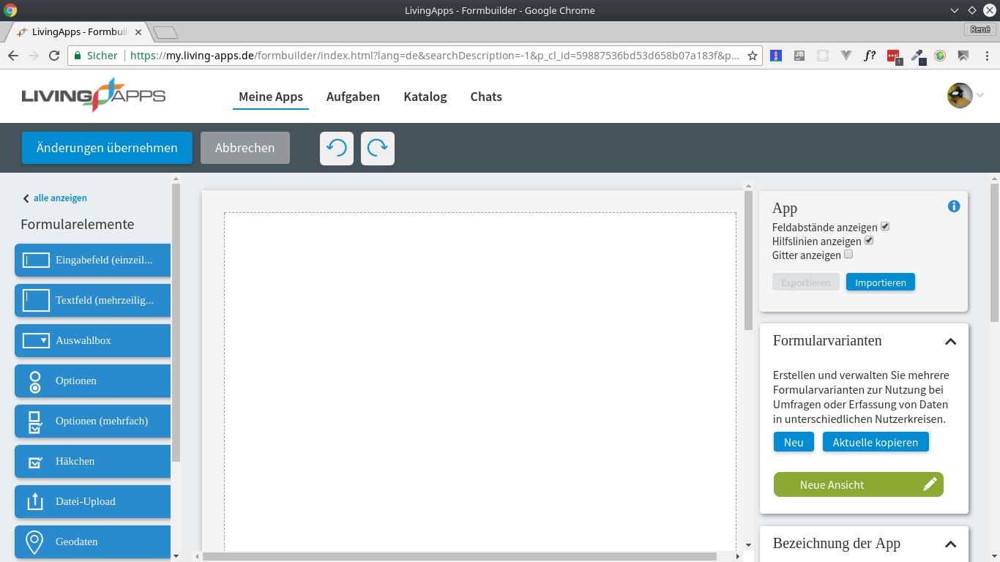
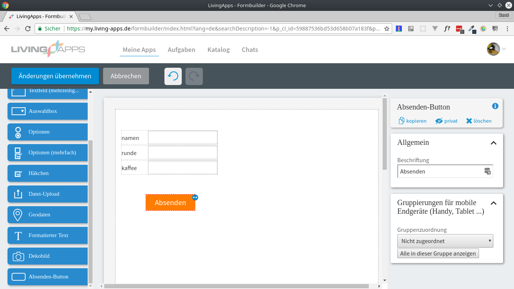
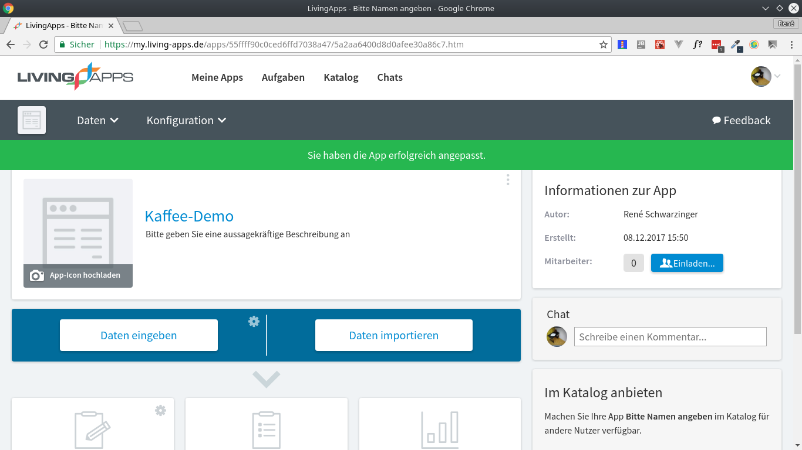
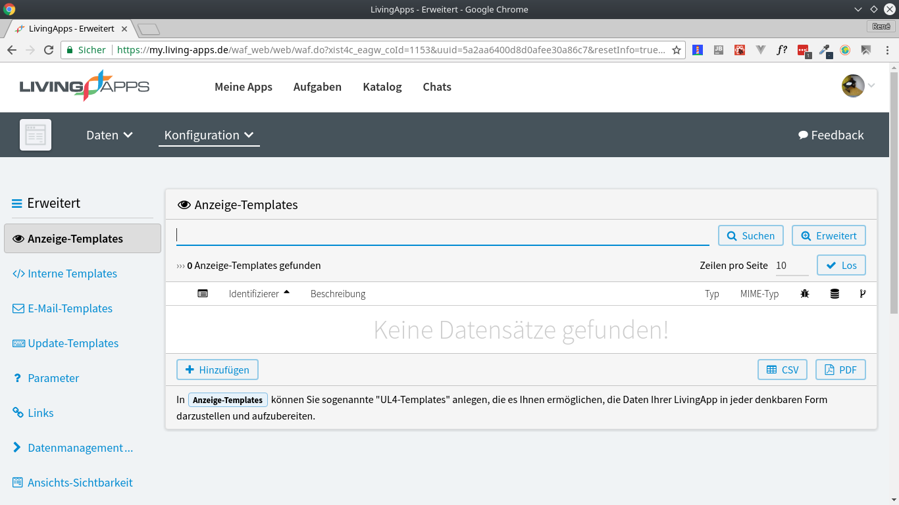
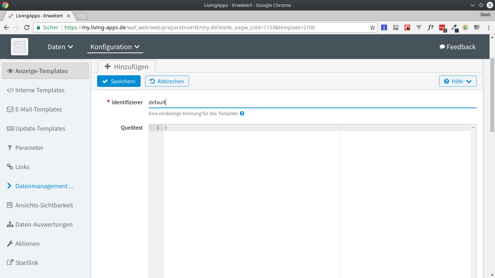
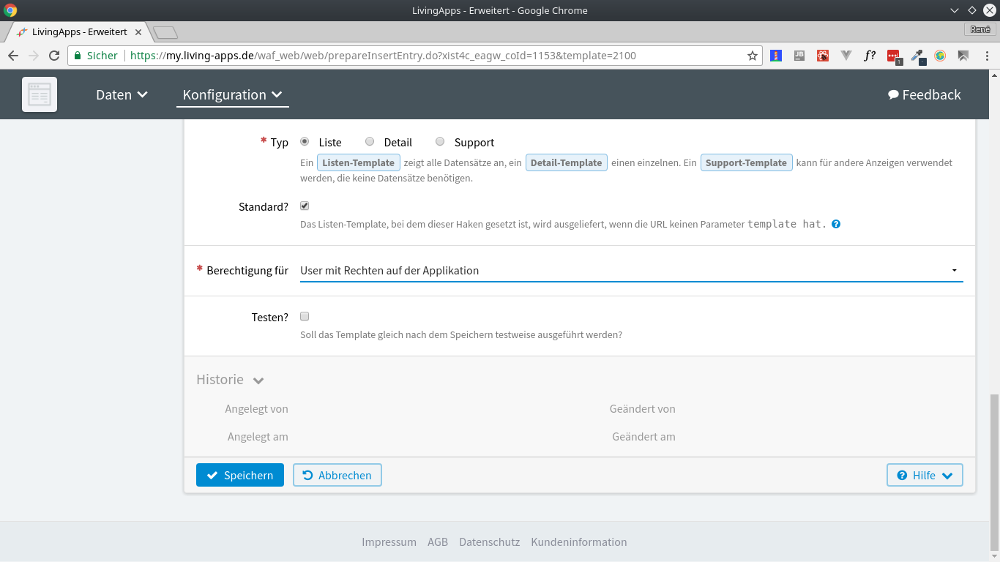
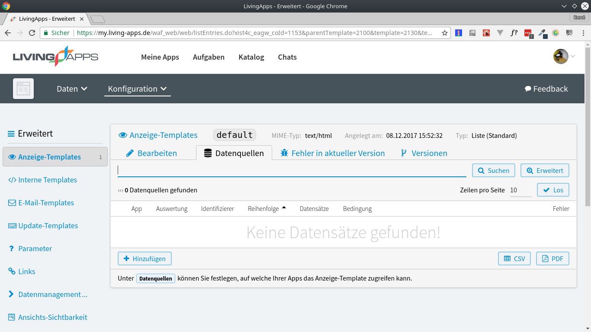
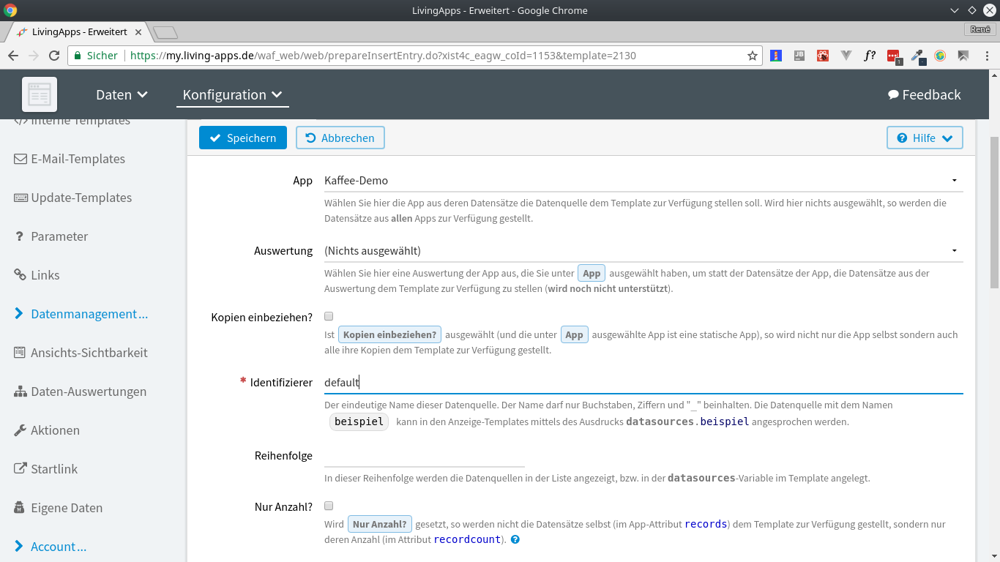
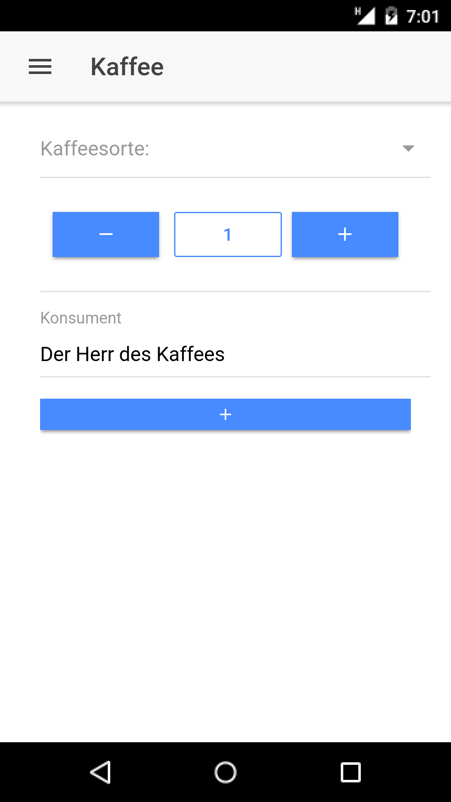
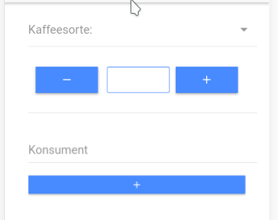

# Apps erstellen mit Ionic und Living-Apps

Kaffee ist eine wichtige Resource in einem Softwareunternehmen,
deshalb verfolgen wir mithilfe einer Living-App wieviel Kaffee
konsumiert wird. Allerdings gibt es keine zentrale Station wo
der Kaffeekonsum eingetragen wird, sondern es wird jeweils fast
immer am Rechner nachgetragen. Nun wollen wir in diesem Beitrag
eine App erstellen, die auf einem in der Küche aufgestellten Tablet
installiert wird und eine zentrale Anlaufstelle zum eintragen des 
Kaffees ist. 
Für diesen Beitrag benötigen Sie etwas Kenntnisse über Javascript
und Ionic.

## Todo-Liste
- eine Living-App
- ein Formular zur Eingabe des Kaffeekonsums

## eine Living-App erstellen
Zuallererst benötigen Sie ein Living-Apps Konto mit erweiterten Rechten,
um später Datenquellen freizuschalten. Folgen Sie einfach der Anleitung
und falls bei ihnen etwas anders aufscheint schreiben Sie uns.



Erstellen Sie eine App in Living-Apps, ihr Fenster sollte nun wie 
oben Aussehen. Nun ziehen Sie mehrere Textfelder und benennen 
diese bitte wie im  Bild darunter zu sehen. Bitte vergessen Sie 
nicht auch einen Absenden-Button zu erstellen.




Damit Sie später die App besser erkennen können benennen Sie die Living-App. Öffnen Sie nun bei Ihrer App den Reiter Erweitert und Konfiguration.



Falls ihr Bildschirm nicht so aussieht wie auf dem Bild oben
(Sie benötigen die Anzeigetemplates) fragen Sie bitte nach
einem erweiterten Account.

Falls Sie bei ihnen alles bisher funktioniert erstellen Sie ein Anzeigetemplate und füllen den Identifizierer ein und für setzen
ein Häkchen bei Standard? und setzen Sie die Berechtigung auf "User mit Rechten auf der Applikation", dami nur Sie und eingeladene Personen später direkten Zugriff darauf haben und keine Dritten.




Anschließend müssen Sie Datenquellen hinzufügen, denn auf diese greifen
Sie später über das SDK zu. Gehen Sie dazu so vor wie in den nächsten zwei Bildern abgebildet.




Wenn Sie diese Schritte abgeschlossen haben, können Sie mithilfe 
des SDKs auf die Datenquellen zugreifen, wie Sie in einem 
späteren Kapitel sehen können.

## Formular zur Eingabe
In der Living-App habe Sie bereits ein Formular erstellt, das Sie online
aufrufen können, allerdings benötigen wir ein Formular in Ihrer App.
Um das möglichst schnell Realisieren können Sie Ionic vordefinierte 
Elemente benutzen. 
Erstellen Sie aber zuerst einmal Ihr Ionic (falls Sie Ionic noch nicht installiert haben können Sie das mit npm i -g Ionic) Projekt mit 

```bash
ionic start
```

Während der Initialisierung des Projekts werden Sie nach einem Template
gefragt, Sie können ein beliebigen nutzen, im Blog verwenden wir aber 
das Blank Template, falls Sie aber die App erweitern wollen können Sie
auch sofort mit einem anderen Template mit einem Menü beginnen.



Die Gestaltung soll nahe einer Vorgängerversion (darüber zu sehen) 
nahe kommen mit einer Auwahlbox für die 
Kaffeesorte, eine Möglichkeit die Rundenzahl (von 1-5) zu erniedrigen und
erhöhen und schließlich ein Textfeld wo Sie Ihren Namen eintragen
können. Darunter soll noch eine Liste aller bereits eingegeben
Namen erscheinen, um eine Schnellauswahl zu ermöglichen.

### Schritt 1. 
Führen Sie folgenden Befehl aus:
```bash
ionic serve
``` 
Dieser Befehl started einen Webserver, der alle gespeicherten Veränderungen 
live nachlädt.

### Schritt 2.
öffnen Sie den Editor ihrer Wahl, in dem Beitrag wird Visual Studio Code verwendet.
```bash
code .
```
Sie sehen nun eine Menge von Ordner und Dateien, für den Beitrag wichtig 
ist nur der "src"-Ordner. In diesem Bearbeiten Sie die Seiten, die später
der App angezeigt werden sollen, während der "www"-Ordner nur den fertig
kompilierten Code beinhaltet. Verändern Sie deshalb nie den Inhalt des
"www"-Ordners, weil Ihre Änderungen nach dem nächstem "build"-Vorgang 
überschrieben werden.
Im "src"-Ordner sind folgenden Ordner und 
Dateien wichtig:
- app Ordner
- pages Ordner
- assets Ordner
- providers Ordner (dieser Ordner sollte noch
nicht existieren, falls er schon existiert,
desto besser)
- index.html

### Schritt 3.
klonen Sie sich das aktuelle offizielle Javascript Livingapi Repository in den "assets"-Ordner
```bash
git clone https://github.com/LivingLogic/LivingApps.Javascript.LivingAPI.git
```
Kopieren Sie die Dateien aus dem "src" Folder
des soeben geklonten Repositories und fügen 
Sie in dem assets Ordner ein. Löschen Sie anschließend den Ordner des geklonten
Repositories, da Sie sonst in ihrem Projekt
Dateien wie den Unittest und diese Dokumentation
in ihrem Projekt dabei haben.

Schritt 4.
Binden Sie nun die einzelnen Dateien im index.html ein.
```html
 <script>
    window.username = prompt("Livingapps Username:");
    window.password = prompt("Livingapps Passwort:"); 
  </script>
  <script
  src="https://code.jquery.com/jquery-3.2.1.min.js"
  integrity="sha256-hwg4gsxgFZhOsEEamdOYGBf13FyQuiTwlAQgxVSNgt4="
  crossorigin="anonymous"></script>
  <script src="./assets/scripts/src/modules/ul4.js"></script>
  <script src="./assets/scripts/src/modules/livingapi.js"></script>
  <script src="./assets/scripts/src/livingSDK.js"></script>
  ```
  Sie haben, wenn Sie den Code kopiert haben neben dem Einbinden der Dateien 
  eine Abfrage des Usernames und des Passwortes
  eingerichtet, Sie können natürlich auf Ihren
  Benutzernamen und ihr Passwort direkt in
  den Variablen hinterlegen, dann müssen Sie
  es nicht immer neu eingeben. Falls Sie die App
  aber veröffentlichen möchten sollten Sie keinesfalls ihre Nutzerdaten im Code stehen haben.

  ### Schritt 5.
  Erzeugen Sie nun einen Provider. Es handelt sich dabei um ein Skript, das später mit LivingApps kommuniziert, damit Sie nicht später bei jeder Seite es neu implementieren müssen.
  ```bash
  ionic g provider la
  ```
 Der erzeugte Provider heißt la und nun sollte bei ihnen der Ordner provider im src-Ordner erstellt worden sein.

### Schritt 6.
Betrachten Sie den soeben erzeugten Provider, die Datei liegt unter "src/providers/la/la.ts".
Löschen Sie aus dem Konstruktor den automatisch erzeugten Parameter und die erste Zeile, 
die HttpClient einbindet, da dieser nicht benötigt wird.
Erzeugen Sie die Instanzvariable window folgendermaßen:
```Javascript
private window: any;
constructor() {
	this.window = window;
}
```
Nun können Sie mit this.window.livingSDK auf das SDK zugreifen. Würden Sie versuchen über window.livingSDK auf das SDK zuzugreifen wird der Typescriptcompiler "meckern", da livingSDK
keine Eigenschaft von Window (dem Interface) ist.

## Kurzes Revue:
Die Schritte 1-6 sind Schritte die Sie absolvieren müssen, bevor Sie mit der eigentlichen Oberfläche
und Logik (in Verbindung mit LivingApps) beginnen. 
- Sie haben eine App angelegt
- Sie haben eine LivingApp angelegt
- Sie haben das livingSDK in index.html eingebunden
- Sie haben einen Provider angelegt
- Sie beobachen alle Veränderungen an ihrem Script im Browser dank ihres gestartet Webservers (Schritt 1)

### Schritt 7.
Lassen Sie uns nun mit der Verbindung zwischen LivingApps und ihrer App beginnen. Betrachten
Sie hierzu zuerst diesen Codeschnipsel und fügen ihn in ihrer Klasse LaProvider ein.
```Javascript
addCoffee (input) {
    return new Promise((resolve, reject) => {
      let lsdk = new this.window.livingSDK({},this.window.username, this.window.password);
      lsdk.get("appid of your Livingapp").then((LAAPI) => {
        let app = LAAPI.get('datasources').get('coffee').app;
        app.insert(input).then((res) => {
          console.log(res);
          resolve(res);
        })
      })
    });
  }
```
Diese Funktion soll die Variable input an Livingapps schicken und dort abspeichern.
Vielleicht ist ihnen schon aufgefallen, das die Funktion asynchon ist, Sie liefert also ein Promise zurück. Es wird eine Instanz (lsdk) des SDKs erzeugt, welches Sie automatisch mit den übergebenen Daten
einloggt. Falls Sie die falschen Daten angegeben haben müssen Sie das Programm abbrechen.
Sie können nun die Daten einer App vom LivingApps-Server abfragen indem Sie lsdk.get("ihre App Id") 
aufrufen. Da diese Funktion ebenfalls Asynchron ist, erhalten Sie ein Promise, welches, falls die
Anfrage erfolgreich war, das die Map LAAPI enthält. Von dieser können Sie die "datasources", die sie
vor Schritt 1 angelegt haben abrufen. Diese "datasources" enthalten die Eigenschaft "app", welches wiederum die Funktion "insert" hat, welcher Sie die ihre Daten, die Sie in ihrer LivingApp speichern
wollen, übergeben. "insert" liefert einen Eintrag zurück.
Sie können diesen im nachhinein auf seine Korrektheit überprüfen.

Hier ist noch ein Codebeispiel, falls Sie Daten abfragen möchten, anstatt Sie wie oben hinzuzufügen.

```Javascript

  listWorkers () {
    return new Promise ((resolve, reject) => {
      let workers = [];
      let lsdk = new this.window.livingSDK({}, this.window.username, this.window.password);
      lsdk.get('ihr App Id').then((LAAPI) => {
        let datasources = LAAPI.get('datasources');
        let app = datasources.get('default').app;
        let records = app.records;
        for (let record of Array.from(records)) {
          let workerMetaData = {
            name: record[1].fields.get('mitarbeiter').value,
            interests: record[1].fields.get('interessensgebiete').value,
            picture: record[1].fields.get('picture').value
          };
          workers.push(workerMetaData);
        }
        resolve(workers);
      })
    });
  }
  ```

Und schon haben Sie ihre gewünschte Verbindung zwischen LivingApps und ihrer App hergestellt,
ab jetzt folgt nur noch UI.

### Schritt 8.
Öffnen Sie nun home.html und löschen den Inhalt des Tags "ion-content". Ändern Sie den Inhalt
des Tags "ion-title" zu "mein Kaffee" oder einem anderen Titel.
Sie haben dadurch einen leeren Contenbereich, dem Sie nun folgendes Element hinzufügen können.
```html
<ion-list>
	...
</ion-list>
```
Sie haben eine Liste erstellt, in der der erste Eintrag (Tag: "ion-item") die Auswahlbox für die Kaffeesorte sein soll.
```html
<ion-label>Kaffeesorte:</ion-label>
    <ion-select value="Mocha" (input)="coffee = $event.target.value">
    <ion-option value="Mocha">Mocha</ion-option>
</ion-select>
```
Das zweite Element der Liste ist ein Zähler, wieviele Kaffees heute getrunken wurden.
Fügen Sie folgenden Code in ein zweites ion-item.
```html
<ion-grid>
    <ion-row>
        <ion-col col-4><button ion-button full (click)="changeNumber(-1)"><ion-icon 	name="remove"></ion-icon></button></ion-col>
        <ion-col col-4><button style="width:100%" ion-button outline>{{number}}</button></ion-col>
        <ion-col col-4><button ion-button full (click)="changeNumber(1)"><ion-icon name="add"></ion-icon></button></ion-col>
    </ion-row>
</ion-grid>
```
Als drittes Element fügen Sie ein Eingabefeld zur Eingabe des Konsumenten hinzu.
```html
<ion-label floating>Konsument</ion-label>
	<ion-input type="text" value="{{consumer}}" (input)="consumer = $event.target.value">
</ion-input>
```

Zuguter letzt benötigen Sie noch einen Absendebutton.
```html
<button ion-button full (click)="add()"><ion-icon name="add"></ion-icon></button>
```



Ihre App solte nun so aussehen wie auf dem Bild.
Allerdings fehlt noch ein Zähler und wenn Sie bestimmte
Elemente anklicken erscheint eine Fehlermeldung. 
Das liegt daran, dass diese Oberfläche mit ein paar Logiken
verbunden ist, die Sie noch nicht erstellt haben, was Sie 
aber im nächsten Schritt nachholen.

### Schritt 9.
Die Auswahl des Kaffees beinhaltet folgenden Code, der bei einer
Veränderung des Wertes der Selectbox aufgerufen wird.
```Javascript
(input)="coffee = $event.target.value"
```
Der Code weist den Wert, den Ihre Option besitzt der Instanzvariablen
coffee zu. Aber moment mal, Sie haben doch noch keine Instanzvariable
coffee erzeugt. Genau das holen Sie jetzt nach, öffnen Sie dazu die 
Datei home.ts und fügen Sie der Klasse HomePage die Variable coffee hinzu.
```Javascript
private coffee: any = "Mocha"; // schonmal vorinitialisiert;
```
Damit ist jetzt der erste Teil vollständig nutzbar.
Für den zweiten Teil benötigen Sie ebenfalls eine solche Variable: 
```Javascript
private number: number = 1;
```
und schon erscheint die 1 im zweiten Button der Reihe.
Mit den Plus- und Minusbutton können Sie die Zahl noch nicht verändern.
Legen Sie dazu eine Funktion, die number verändert und begrenzt. Bspw so:
```Javascript
changeNumber (diffrence: number) {
	if ((this.number <= 1 && diffrence < 0) || (this.number >= 5 && 	diffrence > 0)) {
      return;
    }
    this.number += diffrence;
  }
```
Sie können nun die die Anzahl getrunkener Kaffee am Tag auch verändern.
Jetzt müssen Sie noch den Namen des Konsumenten abfragen, fügen Sie dazu
wieder eine Variable ein:
```Javascript
  private consumer: any = "Der Herr des Kaffees";
```
Es folgt hier wieder dem Schema der Eingabe des Kaffees, die Wertzuweisung
an die Instanzvariable erfolgt im HTML
```Javascript
(input)="consumer = $event.target.value"
```
Nun können Sie mit der App Daten vom User abfragen, aber noch nicht
abschicken, da wenn Sie den Abschickenbutton klicken, dann rufen 
Sie die nicht existente Funktion add() auf.
Für add() benötigen Sie aber noch zugriff auf ihren vorhin erstellten
Provider, den Sie mit 
```Javascript
import { LaProvider }from '../../providers/la/la';
```
in home.ts einbinden und durch Anpassen ihres Konstruktors, instanziieren.
```Javascript
constructor(public navCtrl: NavController, private laProv: LaProvider) {
```
(Achtung !!! Besonderheit von TypeScript, in Javascript verwenden Sie weiterhin
new -- Ionic nutzt TS)

Anschließen können Sie mit der Funktion add() beginnen.
Die Funktion gibt im Codebeispiel zur Kontrolle auf der Konsole 
die zu übermittelnden Daten aus und ruft dann den Provider auf.
```Javascript
  add(){
    console.log("add entry" + JSON.stringify({
      kaffeesorte: 	this.coffee,
      runde: this.number,
      mitarbeiter: this.consumer
    }));
    this.laProv.addCoffee({
      kaffeesorte: 	this.coffee,
      runde: this.number.toString(),
      mitarbeiter: this.consumer
    }).then((res)=>{
      alert("erfolgreich einen Datensatz hinzugefügt");
    });
  }
```

### FIN

Damit haben Sie nun ihre App erstellt und können Sie für die Produktion
noch etwas anpassen und dann ausliefern.

Wir hoffen Sie hatten Spaß.
Für Fragen und Verbesserungen stehen Wir gerne für Sie zur Verfügung.
